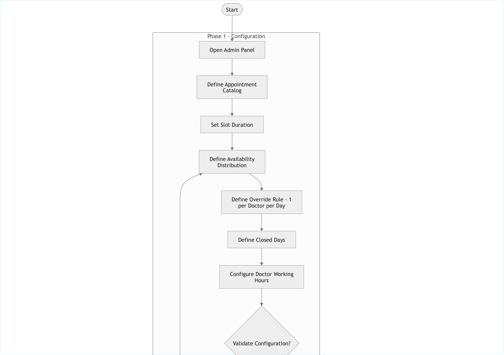
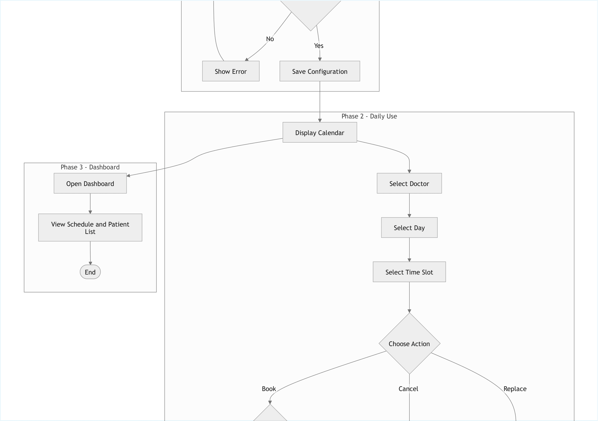
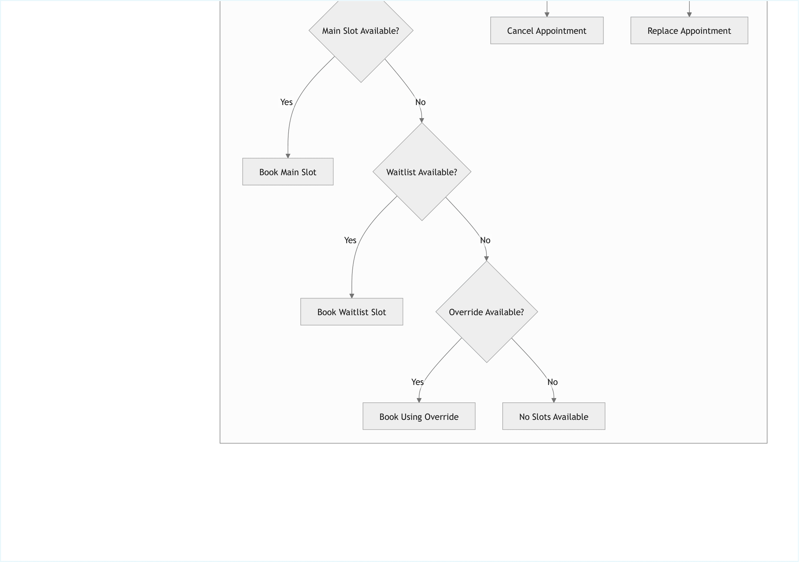

= Clinic / Doctor Experience – Availability and Booking Flowchart
:toc:

== Overview

This flowchart illustrates the complete operational flow for the Clinic / Doctor Experience in Phase 1, Phase 2, and Phase 3 of the system.

It models:

* Administrative configuration of availability rules
* Daily appointment booking logic
* Capacity handling (main slots, waitlist, override)
* Dashboard visualization of appointments

== Phases Covered

=== Phase 1 – Configuration

Includes:

* Appointment catalog definition
* Slot duration configuration
* Availability distribution
* Doctor working hours
* Closed days
* Override rules (1 per doctor per day)
* Configuration validation

=== Phase 2 – Daily Use

Covers:

* Calendar visualization
* Doctor selection
* Time slot selection
* Booking logic
* Canceling and replacing appointments
* Waitlist handling
* Override usage
* Error handling when no slots are available

=== Phase 3 – Dashboard

Displays:

* Doctor schedule
* Patient list
* Daily overview of appointments

== Flowchart Diagram

