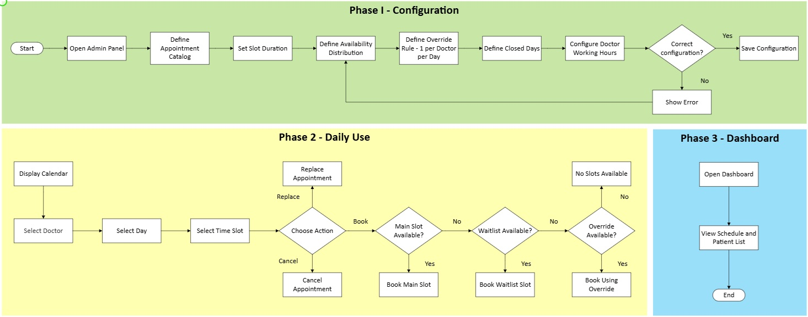

= Milestone 2 Roadmap – Clinic / Doctor Experience
:toc:
:toclevels: 2
:sectnums:

== Overview

This document defines the structured roadmap for Milestone 2 of the Clinic / Doctor Experience team.

The roadmap is aligned with the system flowchart and organizes features in a dependency-aware implementation order to ensure stable scheduling logic, controlled capacity management, and dashboard visibility.

The implementation follows three logical phases:

1. Configuration Layer
2. Daily Operations Layer
3. Dashboard Layer

---

== Clinic System Flow Reference

The roadmap is aligned with the Clinic Experience process flowchart.

The system follows this operational structure:

Configuration → Validation → Booking Decision Tree → State Update → Dashboard Reflection

---

== Phase 1 – Configuration Layer

This phase establishes all scheduling rules before runtime operations.

=== Scope (Milestone 2)

* Define Appointment Catalog
* Set Slot Duration
* Configure Doctor Working Hours
* Define Availability Distribution (Main / Waitlist)
* Define Closed Days
* Define Override Rule (1 per doctor per day)
* Validate Configuration
* Save Configuration

=== Implementation Order

1. Appointment Catalog
2. Slot Duration + Working Hours
3. Availability Distribution
4. Closed Days
5. Override Rule
6. Configuration Validation

This phase establishes the database foundation required for scheduling operations.

---

== Phase 2 – Daily Operations Layer

This phase handles real scheduling behavior.

=== Operational Flow

Display Calendar  
→ Select Doctor  
→ Select Day  
→ Select Time Slot  
→ Choose Action (Book / Cancel / Replace)

Booking follows a decision tree:

* Main Slot Available?
* Waitlist Available?
* Override Available?
* If none available → Show Error

=== Scope (Milestone 2)

* Book Main Slot
* Book Waitlist Slot
* Book Override Slot
* Cancel Appointment (with justification)
* Replace Appointment
* Automatic Slot Count Updates

=== Implementation Order

1. Main Slot Booking Logic
2. Waitlist Logic
3. Override Logic
4. Cancel / Replace Flow
5. Slot Recalculation Logic

Operations depend entirely on Phase 1 configuration stability.

---

== Phase 3 – Dashboard Layer

This phase provides system visibility.

=== Scope (Milestone 2)

* Display Calendar View
* Display Patient List
* Display Slot Usage Summary
* Display Override Usage

The dashboard must reflect real-time appointment state and validated scheduling logic.

---

== Milestone 2 Timeline

=== First Half – Foundation

* Appointment Catalog
* Doctor Working Hours
* Availability Distribution
* Closed Days
* Basic Main Slot Booking

Goal: Establish stable scheduling engine foundation.

=== Second Half – Control & Visibility

* Waitlist Logic
* Override Logic
* Cancel / Replace
* Dashboard Views

Goal: Complete operational loop and monitoring layer.

---

== Task Decomposition Strategy

Each feature will be divided into small, focused tasks (2–4 per feature).

Example:

Availability Management:

* Define schedule model
* Implement configuration form
* Persist schedule
* Validate booking against schedule

Tasks must:

* Be independently completable
* Respect dependency order
* Allow at least one task completion per developer per half

---

== Review and Integration Criteria

Before merging any feature:

* Validate Clinic rule consistency
* Ensure no conflict between capacity and overrides
* Confirm scheduling limitations are enforced
* Confirm dashboard reflects appointment state accurately

---

== Roadmap Summary

Clarify scope → Build foundation → Add constraints → Add visibility → Validate consistency.

This roadmap ensures:

* Dependency-aware implementation
* Reduced integration risk
* Early task creation
* Controlled milestone progression